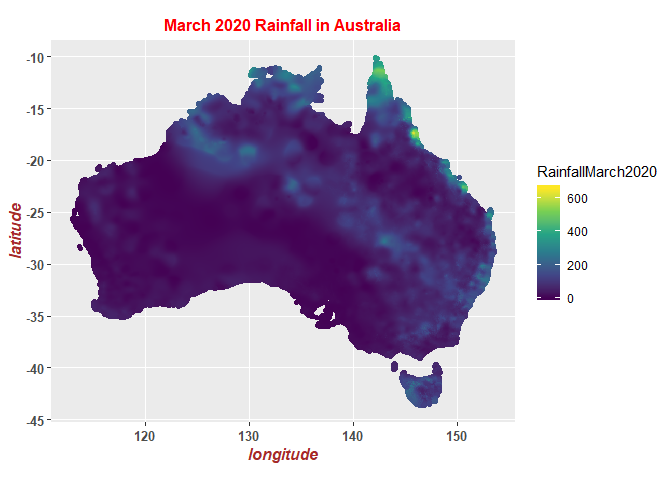
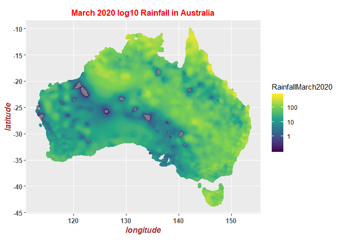
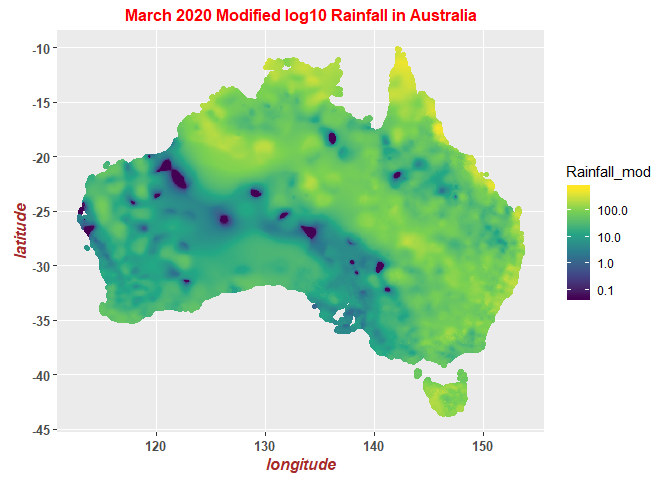
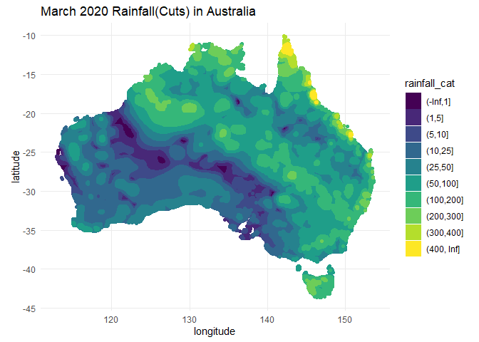

# R Programming

## Set Chunk requirements


```r
knitr::opts_chunk$set(echo = TRUE, message = FALSE, warning = FALSE)
#echo=FALSE indicates that the code will not be shown in the final document 
#(though any results/output would still be displayed).
#include=FALSE to have the chunk evaluated, but neither the code nor its output displayed
# warning=FALSE and message=FALSE suppress any R warnings or messages from being included 
#in the final document
```


## Load Relevant Packages and Data Set

```r
#http://www.bom.gov.au/jsp/awap/rain/archive.jsp?colour=colour&map=totals&year=2020&month=4&day=27&period=month&area=nat

library(rgdal)
library(raster)
library(sp)
library(dplyr)
library(ggplot2)
library(sf)

# Reading our dataset
setwd('E:/Documents/Reinp/GitHub Respositories/R_Spatial')

aus_rainfall <- raster("data/australia/climate/RainfallMarch2020.grid")
australia <-rgdal::readOGR("data/australia/shapefiles/nsaasr9nnd_02211a04es_geo___/aust_cd66states.shp")
```

```
## OGR data source with driver: ESRI Shapefile 
## Source: "E:\Documents\Reinp\GitHub Respositories\R_Spatial\data\australia\shapefiles\nsaasr9nnd_02211a04es_geo___\aust_cd66states.shp", layer: "aust_cd66states"
## with 8 features
## It has 2 fields
## Integer64 fields read as strings:  COUNT
```

```r
rainfall_spdf <- as(aus_rainfall, "SpatialPixelsDataFrame")
rainfall_interior_spdf <- rainfall_spdf[!is.na(over(rainfall_spdf, as(australia,"SpatialPolygons"))),]
rainfall_interior_sf <- st_as_sf(rainfall_interior_spdf)
```


## ggplot 

```r
ggplot() + 
  geom_sf(data = rainfall_interior_sf, 
          aes(fill = RainfallMarch2020,
              colour = RainfallMarch2020)) + 
  scale_fill_viridis_c() +
  scale_colour_viridis_c()+
  labs(title="March 2020 Rainfall in Australia",x="longitude", y = "latitude")+
  theme(axis.title = element_text(face="bold.italic", size="12", color="brown"), 
        axis.text = element_text(size = 10, face="bold"), 
        plot.title=element_text(size=12, face="bold", color="red", hjust = 0.5))
```

<!-- -->

```r
ggplot() + 
  geom_sf(data = rainfall_interior_sf, 
          aes(fill = RainfallMarch2020,
              colour = RainfallMarch2020)) + 
  scale_fill_viridis_c(trans = "log10") +
  scale_colour_viridis_c(trans = "log10")+
  labs(title="March 2020 log10 Rainfall in Australia",x="longitude", y = "latitude")+
  theme(axis.title = element_text(face="bold.italic", size="12", color="brown"), 
        axis.text = element_text(size = 10, face="bold"), 
        plot.title=element_text(size=12, face="bold", color="red", hjust = 0.5))
```

<!-- -->

```r
nonzeroes <- rainfall_interior_sf$RainfallMarch2020[rainfall_interior_sf$RainfallMarch2020 != 0]
small_value <- min(nonzeroes)/2

rainfall_interior_sf1<- mutate(rainfall_interior_sf, 
                                            Rainfall_mod = ifelse(RainfallMarch2020 == 0, small_value,
                                                                  RainfallMarch2020)) 

ggplot() + geom_sf(data = rainfall_interior_sf1, 
        aes(fill = Rainfall_mod,
            colour = Rainfall_mod)) + 
  scale_fill_viridis_c(trans = "log10") +
  scale_colour_viridis_c(trans = "log10") +
  labs(title="March 2020 Modified log10 Rainfall in Australia",x="longitude", y = "latitude")+
  theme(axis.title = element_text(face="bold.italic", size="12", color="brown"), 
        axis.text = element_text(size = 10, face="bold"), 
        plot.title=element_text(size=12, face="bold", color="red", hjust = 0.5))
```

<!-- -->

```r
rainfall_interior_sf2 <- mutate(rainfall_interior_sf, 
              rainfall_cat = cut(RainfallMarch2020, c(-Inf,1,5,10,25,50,100,200,300,400,Inf)))

ggplot() + 
  geom_sf(data = rainfall_interior_sf2, 
          aes(fill = rainfall_cat,
              colour = rainfall_cat)) + 
  scale_fill_viridis_d() + 
  scale_colour_viridis_d() + 
  theme_minimal() +
  labs(title="March 2020 Rainfall(Cuts) in Australia",x="longitude", y = "latitude")
```

<!-- -->


 


